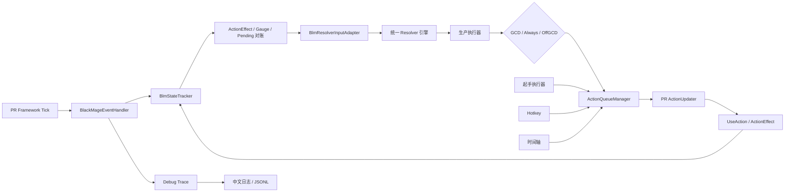

# LOS 项目说明、结构与问题改动记录

本文档记录 LOS 黑魔法师 ACR 的定位、代码结构、运行链路、已完成改动、排查过的问题和当前待办事项。

记录截止：2026-09-19。本次发布版本为 `v1.0.0`，整合此前本地的起手、移动三连、原地黑魔纹修复，并修复黑魔纹热键的魔纹重置冷却判断和回执匹配。

同日完成台服 API13 / .NET 9 适配，台服首版独立发布为 `v1.0.0`；国服已经发布的同名版本保持原样。按用户要求跳过两服黑魔技能机制对比，沿用现有循环规则，详情见 [台服适配与发布](TC适配与发布.md)。

## 1. 项目简介

LOS 是面向 PromeRotation（PR）的《最终幻想 XIV》黑魔法师 ACR，目标是把黑魔的单体、AOE、起手、QT、Hotkey、时间轴和诊断能力放在同一套可验证的执行框架中。

项目的主要能力包括：

- 支持 1–100 级单体循环和分级路由。
- 支持多等级 AOE 循环以及单体/AOE 共享能力技协调。
- 支持 70、80、90、100 级标准起手和 100 级核爆起手。
- 支持日常模式和高难倒计时模式。
- 支持起手检查点恢复、ActionEffect 确认、资源对账和目标切换处理。
- 支持 QT、Hotkey、时间轴节点和自动减伤/打断等 PR 接入。
- 支持黑魔纹、移动三连等带时间条件的主动能力技。
- 支持 Boss 上天时无目标自动处理星灵移位和灵极魂。
- 输出中文可读日志和机器可分析的 JSONL 诊断记录。

LOS 是第三方项目，与 Square Enix、Dalamud 和 PromeRotation 官方无关。

## 2. 当前版本和运行环境

| 项目 | 当前情况 |
| --- | --- |
| 本次发布版本 | `v1.0.0` |
| PR SDK | 国服 API15 `0.1.0-preview.8`；台服 TC `0.1.0-preview.2`（API13） |
| PR 编译引用 | 国服 `1.5.7.2`；台服 `1.3.1.4`；国服本机测试运行版本 `1.5.10.3` |
| 目标框架 | 国服 `net10.0-windows`；台服 `net9.0-windows` |
| 发布产物 | 国服 `Los.dll` / `Los.deps.json` / `Los.zip`；台服 `Los.TC.dll` / `Los.TC.deps.json` / `Los.TC.zip`；各自 `repo.json` |
| 当前本机运行 DLL | `C:\Users\Administrator\AppData\Roaming\XIVLauncherCN\pluginConfigs\PromeRotation\ACR\Los\Los.dll` |
| 配置文件 | `<PR配置目录>\Settings\ACRConfig\Los\LosSettings.json` |
| Debug 日志 | `<PR配置目录>\Settings\ACRConfig\Los\DebugLogs` |

## 3. 整体运行链路



核心原则是“事实采集、决策、投递、确认”分离：

1. `BlmContext` 和 `BlmStateTracker` 提供当前角色、目标、火冰状态、资源和最近技能确认。
2. `BlmResolverInputAdapter` 把运行时事实转换为 Resolver 输入，并映射 QT 设置。
3. Resolver 引擎为同一帧计算 GCD、Always、OffGCD 候选。
4. 生产执行器负责帧匹配、Pending、重复投递保护和 PR 队列投递。
5. PR 的 `ActionUpdater` 决定实际窗口、动画锁、验证和 `UseAction` 调用。
6. 服务器 ActionEffect 回来后，由 Tracker 接收并更新下一帧决策。

## 4. 目录和模块结构

```text
Los.csproj                         主项目，编译为 Los.dll
BLM/
├─ BlackMageRotation.cs             ACR 入口、生命周期和组件组装
├─ BlackMageEventHandler.cs         Framework Tick、ActionEffect 和战斗事件
├─ Core/
│  ├─ BlmContext.cs                  运行时上下文快照
│  ├─ BlmStateTracker.cs             Ack、Gauge、Pending 和战斗代际
│  ├─ BlmSkillBook.cs                技能等级、目标类型和技能分类
│  ├─ BlmDecisionPrimitives.cs       GCD、织入窗口和时间原语
│  └─ BlmBuff.cs / BLMSkill.cs       状态 ID 和技能 ID
├─ Resolvers/
│  ├─ 引擎/Resolver引擎.cs           Resolver 清单、优先级和通道评估
│  ├─ GCD/单体/                      各等级单体 GCD
│  ├─ GCD/AOE/                       各等级 AOE GCD
│  ├─ GCD/通用/                      雷、异言、DOT、瞬发和回冰逻辑
│  ├─ 能力技/                        黑魔纹、三连、即刻、星灵等能力技
│  ├─ Production/                    生产帧和实际投递
│  ├─ BlmResolverInputAdapter.cs     运行时事实到 Resolver 输入的适配
│  ├─ BlmResolverRuntimeMemory.cs    Resolver 运行记忆
│  └─ BlmMotionRuntimeMemory.cs      移动/静止计时记忆
├─ Openers/
│  ├─ BlmOpenerExecutionService.cs   起手状态机、检查点、重试和取消
│  ├─ BlmLevel100Opener.cs            100 级起手定义
│  ├─ BlmOpener57Definition.cs        57 级起手定义
│  └─ BlmAdditionalOpenerDefinitions.cs 其他等级和核爆分支
├─ BossFlight/
│  └─ BlmBossFlightService.cs        Boss 上天无目标处理
├─ Timeline/
│  └─ BlmTimelineNodeProvider.cs     PR 时间轴节点注册
├─ UI/
│  ├─ BlmConsoleWindow.cs             LOS 控制台
│  ├─ Panels/                         概览、战斗、控制、Hotkey 等面板
│  ├─ BlmHotkeyCatalog.cs             Hotkey 清单、Pending 和派发
│  ├─ BlmKeyBindingManager.cs         QT/Hotkey 键位绑定
│  └─ Layout/Theme/Components/        布局、主题和通用控件
├─ Diagnostics/
│  ├─ BlmDebugTraceService.cs         诊断事件和 JSONL 写入
│  ├─ BlmDebugModels.cs               日志模型
│  └─ BlmDebugHumanFormatter.cs      中文日志格式化
└─ Tests/
   ├─ Los.Tests.csproj                回归测试项目
   └─ Program.cs                      无外部测试框架的测试入口
```

## 5. 执行通道和队列约定

LOS 使用三个 Resolver 通道：

| 通道 | 用途 | 典型内容 |
| --- | --- | --- |
| `Gcd` | 主体 GCD | 火四、冰三、悖论、异言、雷系技能 |
| `Always` | 必须优先等待合适时机交付的动作 | 起手桥接、移动三连队列、部分时间轴动作 |
| `OffGcd` | 正常织入窗口中的能力技 | 魔泉、黑魔纹、即刻、星灵、三连 |

PR 的原生起手由动作列表和 `ActionUpdater` 取队列执行。它可以依靠 `RequiresVerification`、动画锁和 ActionEffect 进行重试，但不会像 LOS 的 Resolver 那样重新规划一份动态 GCD/能力技计划。因此 LOS 的起手使用独立状态机和检查点，普通循环则使用 Resolver 帧。

`ActionQueueManager` 又把动作分为高优先级和普通队列。Always 队列会先于普通 GCD/oGCD 被 ActionUpdater 取得；如果 LOS 同时把一个动作放进 Always，又从 OffGCD 返回同一动作，就可能造成重复派发，这正是移动三连问题的根因之一。

## 6. 已完成的功能和改动时间线

### 6.1 Resolver 和生产执行框架

- 完成 Resolver 第二阶段基线，建立黑魔事实、检查码、优先级和 GCD/能力技分层。
- 切换黑魔生产逻辑到统一 Resolver 引擎。
- 补齐 90 级、1–89 级、100 级单体和 AOE 路由。
- 增加共享能力技协调，避免单体/AOE 分支重复抢同一个能力技。
- 增加 Tracker 的 ActionEffect、Gauge、Pending、战斗代际和目标切换对账。

### 6.2 起手和 Hotkey

- 完成 70、80、90、100 级标准起手和 100 级核爆起手。
- 区分日常无倒计时起手和高难倒计时起手。
- 起手支持爆炎预读、药水、黑魔纹、魔泉、三连和后续检查点恢复。
- 起手被手动技能插入后保留当前计划，不直接重排整个起手。
- 起手拉断后清理旧 Pending，再按检查点重试。
- 爆发药 Hotkey 使用 PR 物品编码和 Framework Tick 重试；起手药水使用独立的 HQ/NQ 归一化和确认协议。
- 增加 Hotkey 窗口、单键/组合键/鼠标侧键绑定、隐藏项目和窗口位置持久化。

### 6.3 主动攻击按钮

- LOS 控制窗增加“主动攻击”控制，并放在展开后的设置面板、黑魔职业战斗控制台后方。
- 排查了本体按钮被 LOS UI 覆盖后无法看到的问题。
- 修复 v0.1.4 中发现的脱战后主动攻击不出手问题，使目标重新有效时能正确恢复攻击条件。

### 6.4 Boss 上天

- 从 AE 项目迁移 Boss 上天的思路到 PR。
- 新增 `BlmBossFlightService`，在战斗已持续一定时间、Boss 暂时无目标且 QT 开启时进入准备状态。
- 无目标阶段按 ActionEffect/Pending 顺序自动使用星灵移位和灵极魂，限制最大施放次数并在目标恢复后退出。
- 增加目标恢复、战斗结束、死亡、QT 关闭和 Pending 超时处理。
- 增加 Boss 上天测试组，并在 v0.1.5 发布。

### 6.5 日志和 SDK

- 从旧日志事件迁移到新的 `ActionEffect` 日志接口。
- 增加中文 Debug 事件、Resolver 帧、派发返回、Ack、Gauge 对账和生命周期日志。
- 通过 JSONL 保留机器可分析的字段，例如帧序号、StateGeneration、GCD 剩余、候选动作、队列状态和检查码。
- v0.1.6 升级到 API15 SDK，并调整自动发布流程。
- PR 本体后来过滤了输出到本地文件的 chatlog；LOS 使用的 ActionEffect 事件和自己的 Debug JSONL 不依赖 chatlog 文件过滤，因此该变化没有改变 LOS 的事件接入。

## 7. 已排查的问题记录

| 问题 | 结论或根因 | 处理状态 |
| --- | --- | --- |
| PR 原生起手是否能像 AE 一样动态调度 GCD 和能力技 | PR 原生起手本质是静态动作计划，由 ActionUpdater 取队列；`RequiresVerification` 负责确认和有限重试，不能替代 LOS Resolver 的动态调度 | 已记录为架构边界 |
| PR 是否有简单 countdown/slot | PR 有倒计时入口、动作队列和窗口判断，但 slot 不是一个能自动重排所有 GCD/oGCD 的通用计划器 | 已记录为使用约定 |
| 起手读条被拉断后是否停止 | PR 验证失败可能重试或跳步；LOS 起手状态机现在会清 Pending、按检查点恢复，并在进战代际不匹配时取消 | 已实现并有测试 |
| `RequiresVerification` 拉断后能力技是否会被顶掉 | PR 仍由 ActionUpdater 按当前活动命令、GCD锁和能力技窗口处理；LOS 不在起手阶段直接重排静态列表，而是通过起手执行器和 Pending 保护 | 已记录为 PR 执行器约束 |
| 倒计时后没有执行起手、聊天框出现“预定技能 null” | 日志排查指向倒计时会话、目标绑定、旧 Pending/Hotkey 状态和进战代际之间的残留风险；不能只根据一次手动按键判断 | 已增加生命周期清理和测试，仍需实战继续观察 |
| 副本外手动按热键是否会影响进本起手 | 如果手动动作 Pending 没有在战斗边界清理，就可能与起手竞争；LOS 现有逻辑在战斗、目标、死亡和 Dispose 边界清理 Pending，并在起手中记录安全 Hotkey | 已处理主要路径，仍需关注本体队列残留 |
| 起手阶段移动时反复重试读条 | PR 原生执行器可能在读条动作仍处于活动命令时反复尝试；LOS 已在相关起手/生产路径增加移动条件，并保留执行器的移动抑制边界 | 已处理部分，需结合实际副本机制验证 |
| 战斗结束后热键留到下一把，顶掉新起手 | 这是普通队列、Hotkey Pending 和起手状态机边界没有同时失效时的残留问题 | 已增加起手取消、普通队列清理和 Hotkey Pending 清理；仍列为实战监控项 |
| 绝望后只放星灵，没有即刻，随后硬读冰三 | 记录到 2026-08-06 日志：即刻在 GCD 剩余约 0.40–0.45 秒时才转好，Resolver 选出了候选，但 `CanWeaveNow` 拒绝了实际派发 | 已记录为已知问题，暂未修复 |
| 移动超过阈值但没有瞬发时不放三连 | 原逻辑要求 `!IsCasting`、有织入窗口，长读条和 GCD 空转时无法入队；同时移动计时需要运行时状态记忆 | 当前工作区已改为达到阈值后进入 Always 队列，优先保留悖论/异言等瞬发 |
| 反复移动/读条拉断后移动计时重置，十几秒不放三连 | 移动时长按连续移动起算，站定读条即清零；移动 1 秒、站定读条被拉断、再移动的循环会永远到不了阈值 | 已改为按 GCD 空转时长触发（瞬发 GCD 从冷却转好起算，读条 GCD 从成功时刻起算），站定读条（含被拉断）不清零，只有 GCD 成功才重新起算 |
| 移动三连用过一次后约 60 秒内不再触发 | PR `GetActionCharges` 根据客户端冷却进度计算小数充能（1.58 = 1 层 + 58%），不是服务器上报异常；`CanCast` 只看总恢复冷却，充能恢复期间可能误报不可用 | 已改为对双充能技能按完整充能层数（`Charges >= 1`）判定就绪，覆盖 `CanCast` 误报；三连咏唱、黑魔纹同步修复，并在帧 JSONL 增加空转/充能/CanCast/阈值字段 |
| 移动三连连续释放两个 | 同一移动窗口先进入 Always 队列，普通 OffGCD 随后又返回 7421，造成两条派发路径 | 已增加三连 buff 检测（`TriplecastStacks > 0` 时不再入队、Resolver 不再产生候选），入队到交付之间用最长 3 秒在途标记防止重复派发 |
| 黑魔纹释放后再按热键，魔纹重置不执行 | 热键一直按黑魔纹 3573 检查冷却和充能，没有解析实际形态 36988；本体无充能时会挡住重置 | v1.0.0 按实际形态判定就绪，冻结按键意图，等待期间形态变化就取消 |
| 魔纹重置实际成功却报黑魔纹等待回执超时 | 2026-09-19 02:21:58.827 提交记录为 3573，02:21:58.898 游戏回执为 36988；旧代码仅按原 ID 清理 Pending | v1.0.0 按实际提交 ID 匹配回执，同一热键按逻辑 ID 去重 |
| 火四读条中按三连/黑魔纹偶发不执行 | 早先相关副本日志已清理；当前热键不调用 `CanCast`，不能直接归因于充能误判，也不能把黑魔纹变体问题套到三连 | 保留为待复现问题；区分入队拒绝、读条等待、提交失败和回执超时 |
| 主动攻击按钮被 LOS UI 覆盖 | 控制面板覆盖了本体按钮，用户无法找到原按钮 | 已在 LOS 设置面板提供主动攻击入口 |
| 打开主动攻击后选中目标仍不攻击 | 脱战/目标恢复状态没有重新满足攻击条件 | v0.1.4 已修复 |
| PR 本体日志精简、过滤 chatlog 是否影响 LOS | LOS 依赖的是 ActionEffect 事件和自身 JSONL，不依赖本地 chatlog 文件输出 | 已确认无直接影响 |
| TC 服务器支持 | 最新示例及官方 TC SDK 目标已是 API13 / .NET 9，早期 API12 假设已过时；编译差异为玩家枚举和副本成员表字段名 | 已完成同源双构建、必要接口兼容、独立配置/程序集/更新源；两服各 20 组测试通过，台服实机待验证，API12 不在本次范围 |

## 8. v1.0.0 合入的本地改动

以下内容纳入 v1.0.0；完整发布说明见 [v1.0.0](releases/v1.0.0.md)：

1. `BlmMotionRuntimeMemory` 记录移动/静止开始时间、状态代际和持续时长，并以本代际首个有效帧和上一发 GCD 的转好时刻为基准计算 GCD 空转时长（瞬发 GCD 按成功时刻加 GCD 总长折算，读条 GCD 直接用成功时刻）。
2. `MoveTriplecastSeconds` 作为移动三连的 GCD 空转阈值；正在移动、空转达到阈值且悖论、异言、雷系等瞬发资源都不可用时，保留三连候选。站定读条（含被拉断）不清零空转，只有 GCD 成功才重新起算。
3. 即使当前正在长读条、GCD 尚未结束或存在动画锁，也可以先将三连放入普通 Always 队列，交给 PR 执行器等待实际交付窗口。
4. 移动三连进入 Always 队列后，普通 OffGCD 入口不会再返回同一个 7421 候选。
5. 身上已有三连 buff（`TriplecastStacks > 0`）时不再入队；入队到交付之间的在途窗口用最长 3 秒标记防止每 Tick 重复入队。
6. 战斗/目标/状态代际失效时清理移动三连标记。
7. 新增“GCD 已结束”“长读条/GCD 未结束”移动三连回归测试，以及读条拉断后空转继续累计、旧 Ack 不撑大新代际空转的运动记忆测试。
8. 双充能技能（三连咏唱、黑魔纹）就绪判定加入完整充能层数兜底：PR 由客户端冷却进度计算小数充能，而 `CanCast` 在总恢复冷却未结束时返回 false，原闸门会挡住仍有完整充能的技能。
9. 帧 JSONL 的 `resolver` 段新增 `gcdStarvationMs`、`movingDurationMs`、`stationaryDurationMs`、`hasAvailableInstantGcd`、`moveTriplecastSeconds`、`triplecastCharges`、`triplecastCooldownRemainMs`、`triplecastCanCast`，用于直接判定移动三连各闸门状态。
10. 倒计时起手允许暂时未绑定目标，在预读前绑定，并记录准备失败的具体条件。
11. 黑魔纹热键按实际技能形态判断、提交和确认；等待期间形态失效取消请求，避免误用新黑魔纹。

v1.0.0 本机验证：Release 主项目及测试项目均为 0 警告、0 错误，20 个测试组全部通过；新增热键组包含 6 个场景。测试使用 PR 1.5.10.3 与 Dalamud 15.0.3.5，游戏内实际释放仍需实战复核。

### 8.1 台服 v1.0.0 适配

- 以 `ClientRegion=CN/TC` 选择 SDK、运行框架、程序集和输出目录；默认 CN 保持原有命令与路径。
- `BLM/Compatibility/LosPlatform.cs` 统一平台标识；台服作者与配置目录为 `Los-TC`，程序集为 `Los.TC`。
- `PrApiCompatibility.cs` 兼容 `ObjectKind.Pc/Player` 和 `ContentMemberType` 的两个人数字段。通过真实 Lumina 表行测试确认两套定义读取相同的列偏移 4/5。
- Resolver、起手、热键、时间轴、Boss 上天和技能机制保持共用；未进行两服技能机制对比。
- `Los_PR-TC` 独立发布仓库调用主仓库可复用工作流，通过完整源码 SHA 构建并发布，记录编译引用版本与测试来源。
- 两服 Release 编译均为 0 警告、0 错误，各 20 组测试通过；国服使用真实安装依赖，台服使用补齐 Serilog/Lumina 的 SDK 离线依赖，尚未台服游戏内验证。

## 9. 配置和默认策略

主要设置保存在 `LosSettings.json`：

- `MoveTriplecastSeconds`：移动三连的 GCD 空转阈值，默认 1.5 秒，限制在 0–10 秒；移动中 GCD 空转达到该时长即触发，瞬发 GCD 后从冷却转好起算。
- `StationaryLeyLinesSeconds`：原地黑魔纹阈值，默认 3 秒，限制在 0–30 秒。
- `移动三连`、`黑魔纹`、`三连进冰`、`Boss上天` 等 QT。
- 日常预设默认开启更积极的移动三连/黑魔纹；高难预设默认收紧这些主动行为。
- Hotkey 绑定、隐藏技能、窗口坐标和缩放会单独持久化。

移动三连的触发和优先级是：

1. 先检查悖论、异言、雷系和其他可用瞬发 GCD。
2. 没有可用瞬发、正在移动且 GCD 空转（瞬发后从冷却转好起算）达到阈值时，生成三连候选；站定读条（含被拉断）不清零空转。
3. 如果普通织入窗口不存在，直接进入 Always 队列等待交付。
4. 身上已有三连 buff 时不再入队；在途窗口内禁止普通 OffGCD 再次返回同一三连。

黑魔纹则要求 QT 开启、技能可用、目标和战斗条件满足，并在原地持续时间达到设置阈值后才允许自动使用。

## 10. 日志排查方法

优先查看：

```text
C:\Users\Administrator\AppData\Roaming\XIVLauncherCN\pluginConfigs\PromeRotation\Settings\ACRConfig\Los\DebugLogs
```

常用字段：

- `Resolver.Frame.Gcd`、`Resolver.Frame.Always`、`Resolver.Frame.OffGcd`：每帧候选和阻断原因。
- `Resolver.Queue`：LOS 主动放入普通队列的动作。
- `DispatchReturned`：Resolver、起手、Hotkey 或时间轴实际返回的动作。
- `AckAccepted` / `AckRejected`：服务器 ActionEffect 是否被 Tracker 接受。
- `gcdRemainSeconds`、`animationLockSeconds`、`isCasting`、`isMoving`：执行窗口事实。
- `gcdStarvationMs`、`hasAvailableInstantGcd`、`moveTriplecastSeconds`：移动三连的空转计时、瞬发占用和实际阈值。
- `triplecastCharges`、`triplecastCooldownRemainMs`、`triplecastCanCast`：三连咏唱充能进度与 PR 就绪上报。
- `highPriorityQueueActive`、`remainingWeaves`：Hotkey/时间轴是否占用插槽。
- `frameSequence`、`stateGeneration`、`combatSerial`：判断是否为旧帧或旧战斗残留。

排查起手时，应同时对照 PR 的 Dalamud 日志和 LOS JSONL，区分“Resolver 没有返回”“ActionUpdater 没有执行”“UseAction 返回失败”和“服务器没有 Ack”四种情况。

## 11. 构建、测试和发布

主项目构建：

```powershell
dotnet build .\Los.csproj -c Release -p:TreatWarningsAsErrors=true
```

测试项目需要真实的 PromeRotation、ECommons 和 Dalamud DLL：

```powershell
dotnet build .\Tests\Los.Tests.csproj -c Release `
  -p:PromeRotationDir=<PromeRotation插件目录> `
  -p:DalamudHooksDir=<Dalamud Hooks目录> `
  -p:TreatWarningsAsErrors=true

dotnet run --project .\Tests\Los.Tests.csproj -c Release --no-build `
  -p:PromeRotationDir=<PromeRotation插件目录> `
  -p:DalamudHooksDir=<Dalamud Hooks目录>
```

发布通过 `v*` 标签或 GitHub Actions 的 `Build and Release` 完成。发布脚本会生成 `Los.zip`、`repo.json` 并计算 SHA-256，不会把 PromeRotation、Dalamud 或 ECommons 打进 LOS 压缩包。

上述为国服流程。台服使用 `-p:ClientRegion=TC` 构建；本机离线测试与打包运行 `scripts/New-AcrRelease.ps1 -ClientRegion TC -Version 1.0.0 -SdkOfflineTests`。台服发布从独立仓库 Actions 的 `Release LOS TC` 输入版本和主仓库源码 SHA，要求源码中的元数据版本已匹配，具体见 [台服适配与发布](TC适配与发布.md)。

## 12. 后续待办和风险

- 实战确认黑魔纹无充能时的魔纹重置、读条中排队以及魔纹到期取消行为。
- 实战确认移动机制中“空转累计触发、三连立即入队、buff 期间不再入队、buff 耗尽后再次触发”的完整行为。
- 继续收集即刻进冰窄窗口日志，决定是否加入“冷却转好后至少保留 0.6 秒织入窗口”的判断。
- 继续检查战斗结束、团灭、目标丢失和副本外热键对下一次起手的影响。
- 台服实机确认加载、倒计时起手、黑魔纹/魔纹重置热键、移动三连和战斗边界；本次没有核对两服技能机制。
- 保持 PR ActionUpdater、ActionQueueManager 及 API15/TC API13 SDK 更新后的兼容性验证。

## 13. 版本记录

| 版本/阶段 | 主要内容 |
| --- | --- |
| Resolver Phase 2 | 建立黑魔事实、Resolver 优先级和基础决策原语 |
| Phase 3B | 切换生产执行器，加入 Tracker、起手、Hotkey 和日志边界 |
| `v0.1.0` | Los 初版发布，包含标准黑魔循环和发布压缩包 |
| `v0.1.1` | 日常起手范围限定到八人本 |
| `v0.1.2` | API15 自动构建和发布流程逐步稳定 |
| `v0.1.3` | 控制台和发布脚本调整 |
| `v0.1.4` | 修复主动攻击脱战不出手 |
| `v0.1.5` | 加入 Boss 上天 QT，并记录即刻进冰窄窗口问题 |
| `v0.1.6` | 升级 PR SDK/API15 发布链路 |
| `v1.0.0` | 黑魔纹热键变体与回执修复；合入倒计时目标绑定、移动三连队列去重、计时与充能修复 |
| 台服 `v1.0.0` | 同源 CN/TC 双构建、API13 必要接口兼容、独立程序集/配置/更新源；沿用现有循环，待台服实机验证 |
